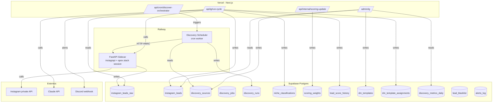
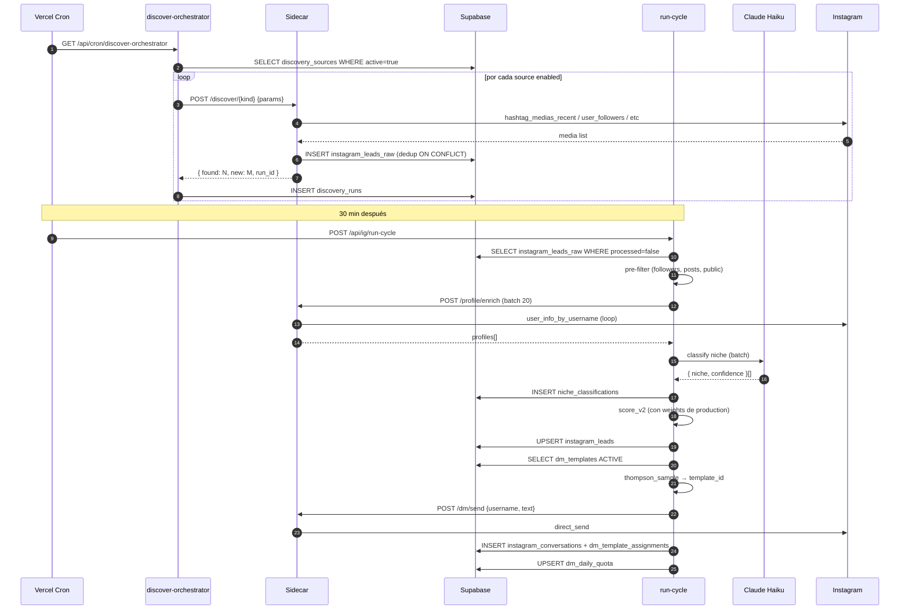

# ARCHITECTURE — Discovery System v2

> Documento técnico complementa `MASTER-PLAN.md`. Diagramas, contratos, schemas, failure modes.

---

## 1 · Diagrama de componentes



---

## 2 · Flujo end-to-end (happy path)



---

## 3 · Contratos del Sidecar (HTTP)

Todos los endpoints requieren header `X-Signature` (HMAC-SHA256 de `body` con `SIDECAR_SHARED_SECRET`).

### 3.1 `POST /discover/hashtag`

```jsonc
// Request
{ "tag": "modaargentina", "limit": 50 }

// Response 200
{
  "run_id": "uuid",
  "tag": "modaargentina",
  "media_seen": 50,
  "users_unique": 38,
  "users_new": 27,        // no estaban en leads_raw
  "errors": []
}

// Response 503 (circuit open)
{ "error": "ig_login_challenge", "retry_after_seconds": 600 }
```

### 3.2 `POST /discover/location`

```jsonc
{ "location_pk": 213385402, "limit": 50 }
// Response: igual a hashtag, con `location_pk` en lugar de `tag`
```

### 3.3 `POST /discover/competitor-followers`

```jsonc
{ "username": "boutiqueejemplo", "max_users": 200 }
// Response añade `cursor` para paginación incremental
{
  "run_id": "uuid",
  "username": "boutiqueejemplo",
  "users_seen": 200,
  "users_new": 145,
  "next_cursor": "abc123",   // null si terminó
  "rate_limit_hit": false
}
```

### 3.4 `POST /discover/post-engagers`

```jsonc
{ "media_pk": "3214567890", "kind": "likers" }   // o "commenters"
{ "run_id": "uuid", "users_seen": 87, "users_new": 62 }
```

### 3.5 Endpoints existentes (no cambian)

- `POST /profile/enrich {usernames: string[]}` — ya implementado
- `POST /dm/send {username, text}` — ya implementado
- `GET /inbox/poll?since_ts=N` — ya implementado
- `GET /health` — ya implementado

---

## 4 · Schemas SQL nuevos

### 4.1 `discovery_sources` — definición de fuentes activas

```sql
CREATE TABLE discovery_sources (
  id            uuid PRIMARY KEY DEFAULT gen_random_uuid(),
  kind          text NOT NULL CHECK (kind IN ('hashtag','location','competitor_followers','post_engagers')),
  -- Identificador único humano-legible:
  ref           text NOT NULL,
  -- Parámetros json (limit, max_users, etc):
  params        jsonb NOT NULL DEFAULT '{}'::jsonb,
  -- Cadencia cron (formato 5-field):
  schedule_cron text NOT NULL DEFAULT '0 */6 * * *',
  active        boolean NOT NULL DEFAULT true,
  priority      int NOT NULL DEFAULT 50,    -- 0-100, mayor = más prioritario
  notes         text,
  created_at    timestamptz NOT NULL DEFAULT now(),
  updated_at    timestamptz NOT NULL DEFAULT now(),
  UNIQUE (kind, ref)
);

CREATE INDEX idx_disc_sources_active ON discovery_sources(active, priority DESC);
```

### 4.2 `discovery_runs` — log inmutable de cada ejecución

```sql
CREATE TABLE discovery_runs (
  id              uuid PRIMARY KEY DEFAULT gen_random_uuid(),
  source_id       uuid REFERENCES discovery_sources(id) ON DELETE SET NULL,
  kind            text NOT NULL,
  ref             text NOT NULL,
  started_at      timestamptz NOT NULL DEFAULT now(),
  ended_at        timestamptz,
  status          text NOT NULL DEFAULT 'running' CHECK (status IN ('running','ok','error','rate_limited','circuit_open')),
  users_seen      int DEFAULT 0,
  users_new       int DEFAULT 0,
  error_message   text,
  metadata        jsonb DEFAULT '{}'::jsonb
);

CREATE INDEX idx_disc_runs_started ON discovery_runs(started_at DESC);
CREATE INDEX idx_disc_runs_source ON discovery_runs(source_id, started_at DESC);
```

### 4.3 `niche_classifications`

```sql
CREATE TABLE niche_classifications (
  id              uuid PRIMARY KEY DEFAULT gen_random_uuid(),
  ig_username     text NOT NULL,
  niche           text NOT NULL,
  confidence      numeric(3,2) NOT NULL CHECK (confidence BETWEEN 0 AND 1),
  reason          text,
  classifier      text NOT NULL DEFAULT 'claude-haiku-4',
  prompt_hash     text NOT NULL,    -- hash del bio+category usados → cache key
  classified_at   timestamptz NOT NULL DEFAULT now(),
  expires_at      timestamptz NOT NULL DEFAULT (now() + interval '30 days')
);

CREATE UNIQUE INDEX idx_niche_username_active ON niche_classifications(ig_username) WHERE expires_at > now();
CREATE INDEX idx_niche_prompt_hash ON niche_classifications(prompt_hash);
```

### 4.4 `scoring_weights`

```sql
CREATE TABLE scoring_weights (
  id              uuid PRIMARY KEY DEFAULT gen_random_uuid(),
  version         int NOT NULL,
  status          text NOT NULL DEFAULT 'staging' CHECK (status IN ('staging','production','retired')),
  -- Pesos json: {feature_name: weight_float}
  weights         jsonb NOT NULL,
  trained_on_n    int NOT NULL DEFAULT 0,
  promoted_at     timestamptz,
  retired_at      timestamptz,
  created_at      timestamptz NOT NULL DEFAULT now(),
  notes           text
);

CREATE UNIQUE INDEX idx_scoring_one_production ON scoring_weights(status) WHERE status='production';
CREATE INDEX idx_scoring_version ON scoring_weights(version DESC);
```

### 4.5 `lead_score_history`

```sql
CREATE TABLE lead_score_history (
  id              bigserial PRIMARY KEY,
  lead_id         uuid NOT NULL REFERENCES instagram_leads(id) ON DELETE CASCADE,
  weights_version int NOT NULL,
  score           int NOT NULL,
  features        jsonb NOT NULL,
  computed_at     timestamptz NOT NULL DEFAULT now()
);

CREATE INDEX idx_score_hist_lead ON lead_score_history(lead_id, computed_at DESC);
```

### 4.6 `dm_templates`

```sql
CREATE TABLE dm_templates (
  id              uuid PRIMARY KEY DEFAULT gen_random_uuid(),
  name            text NOT NULL UNIQUE,
  body            text NOT NULL,        -- contiene {placeholders}
  variables       text[] NOT NULL DEFAULT '{}',  -- nombres requeridos
  status          text NOT NULL DEFAULT 'active' CHECK (status IN ('draft','active','paused','killed')),
  created_at      timestamptz NOT NULL DEFAULT now(),
  killed_at       timestamptz,
  notes           text
);
```

### 4.7 `dm_template_assignments`

```sql
CREATE TABLE dm_template_assignments (
  id              bigserial PRIMARY KEY,
  lead_id         uuid NOT NULL REFERENCES instagram_leads(id) ON DELETE CASCADE,
  template_id     uuid NOT NULL REFERENCES dm_templates(id),
  sent_at         timestamptz NOT NULL DEFAULT now(),
  replied         boolean NOT NULL DEFAULT false,
  replied_at      timestamptz,
  reply_was_positive boolean,    -- detectado por sentiment Haiku
  UNIQUE (lead_id, template_id)
);

CREATE INDEX idx_dm_assign_template ON dm_template_assignments(template_id, replied);
```

### 4.8 `discovery_metrics_daily` (materialized view)

```sql
CREATE MATERIALIZED VIEW discovery_metrics_daily AS
SELECT
  date_trunc('day', dr.started_at)::date AS day,
  dr.kind AS source_kind,
  count(*) FILTER (WHERE dr.status='ok') AS runs_ok,
  count(*) FILTER (WHERE dr.status!='ok') AS runs_err,
  coalesce(sum(dr.users_seen), 0) AS users_seen,
  coalesce(sum(dr.users_new), 0) AS users_new,
  coalesce((
    SELECT count(*) FROM instagram_leads il
    WHERE il.discovered_via = dr.kind
      AND date_trunc('day', il.created_at) = date_trunc('day', dr.started_at)
      AND il.status = 'contacted'
  ), 0) AS dms_sent,
  coalesce((
    SELECT count(*) FROM instagram_leads il
    WHERE il.discovered_via = dr.kind
      AND date_trunc('day', il.created_at) = date_trunc('day', dr.started_at)
      AND il.replied_at IS NOT NULL
  ), 0) AS replies
FROM discovery_runs dr
GROUP BY 1, 2;

CREATE UNIQUE INDEX idx_dmd_day_kind ON discovery_metrics_daily(day, source_kind);
-- refresh nightly via pg_cron o desde un cron Vercel
```

### 4.9 `lead_blacklist`

```sql
CREATE TABLE lead_blacklist (
  ig_username     text PRIMARY KEY,
  reason          text NOT NULL,
  blacklisted_at  timestamptz NOT NULL DEFAULT now(),
  blacklisted_by  text NOT NULL DEFAULT 'system'  -- o user email
);
```

### 4.10 `alerts_log`

```sql
CREATE TABLE alerts_log (
  id            bigserial PRIMARY KEY,
  severity      text NOT NULL CHECK (severity IN ('info','warning','critical')),
  source        text NOT NULL,
  message       text NOT NULL,
  metadata      jsonb DEFAULT '{}'::jsonb,
  triggered_at  timestamptz NOT NULL DEFAULT now(),
  acked_at      timestamptz
);
```

### 4.11 Mutaciones a `instagram_leads`

```sql
ALTER TABLE instagram_leads
  ADD COLUMN IF NOT EXISTS niche text,
  ADD COLUMN IF NOT EXISTS niche_confidence numeric(3,2),
  ADD COLUMN IF NOT EXISTS engagement_rate numeric(5,4),
  ADD COLUMN IF NOT EXISTS scoring_version int,
  ADD COLUMN IF NOT EXISTS template_id uuid REFERENCES dm_templates(id),
  ADD COLUMN IF NOT EXISTS replied_at timestamptz;

CREATE INDEX IF NOT EXISTS idx_leads_niche ON instagram_leads(niche);
CREATE INDEX IF NOT EXISTS idx_leads_status_score ON instagram_leads(status, lead_score DESC);
```

---

## 5 · Configuración env vars nuevas

| Variable | Donde | Default | Descripción |
|---|---|---|---|
| `ANTHROPIC_API_KEY` | Vercel | (requerida) | Claude API |
| `CLAUDE_HAIKU_MODEL` | Vercel | `claude-haiku-4-20250514` | Override modelo Haiku |
| `CLAUDE_SONNET_MODEL` | Vercel | `claude-sonnet-4-5` | Override modelo Sonnet |
| `DISCOVERY_ENABLED` | Vercel | `true` | Kill-switch global |
| `MIN_SCORE_FOR_DM` | Vercel | `60` | Umbral score (era 25 en v1) |
| `MAX_LEADS_PER_RUN_CYCLE` | Vercel | `30` | Top de leads procesados por corrida |
| `DISCORD_ALERT_WEBHOOK` | Vercel | (opcional) | URL webhook Discord |
| `ADMIN_EMAILS` | Vercel | `manunv97@gmail.com` | Comma-separated, autorizados a `/admin/ig` |

---

## 6 · Failure modes y mitigaciones

| Falla | Detección | Mitigación |
|---|---|---|
| IG login challenge | sidecar 503 `ig_login_challenge` | circuit open 1h, alerta Discord critical, `reset_ig_client()` después de re-login manual |
| IG rate limit | sidecar 429 / mensajes específicos instagrapi | circuit open 30 min, exponential backoff entre runs |
| Claude API down | timeout 30s | skip clasificación, marcar lead `niche=null`, retry en próximo cycle |
| Supabase down | error en query | propagar 503, scheduler reintenta en próxima cron tick |
| Quota Vercel agotada | 429 en `/api/cron/*` | scheduler fallback a Railway (futuro) |
| Bug introduce score=0 a todos | `scoring_weights` versionado, shadow A/B | rollback a versión `production` anterior con UPDATE |
| Template muy malo manda spam | auto-pause si CTR < 50% del best tras 100 sends | tabla `dm_templates.status='paused'` |
| Lead duplicado en raw | UNIQUE constraint en `ig_username` con `ON CONFLICT DO NOTHING` | dedup automático |
| Discovery satura raw → backlog gigante | `MAX_LEADS_PER_RUN_CYCLE` + alerta si raw > 5000 | priorizar fuentes high-quality |

---

## 7 · Algoritmo Niche Classifier

```python
SYSTEM_PROMPT = """Sos un clasificador de cuentas de Instagram para un agente que vende sitios web a boutiques.

Dada información de un perfil, devolvé JSON estricto:
{"niche": "<categoria>", "confidence": <0.0-1.0>, "reason": "<máx 80 chars>"}

Categorías permitidas:
- moda_femenina      (ropa para mujer adulta)
- moda_masculina     (ropa para hombre adulto)
- indumentaria_infantil
- accesorios          (carteras, bijouterie no-fina, lentes)
- calzado
- belleza_estetica   (centros estéticos, productos beauty)
- joyeria             (joyería fina, plata/oro)
- otro               (no es ninguno de los anteriores pero tiene contenido comercial)
- descartar          (cuenta personal sin comercio, spam, política, etc)

Confidence: qué tan seguro estás. <0.6 → marcaremos para revisión humana.

NO inventes datos. Si la bio es vacía, basate en business_category y nombre.
"""

USER_TEMPLATE = """Username: @{username}
Nombre completo: {full_name}
Categoría IG: {business_category}
Bio:
\"\"\"{biography}\"\"\"
Últimos 3 captions:
{recent_captions}
"""
```

Respuesta parseada con `json.loads`, validación con pydantic. Reintento 1× si JSON inválido.

---

## 8 · Algoritmo Scoring v2

```python
features = {
  "followers_log":        log10(profile.followers + 1) / 5.0,             # → 0..1
  "posts_log":            log10(profile.posts + 1) / 4.0,
  "engagement_rate":      min(profile.engagement_rate * 5, 1.0),          # 20% = 1.0
  "has_business_category": 1.0 if profile.business_category else 0.0,
  "business_category_match": fuzzy_match(profile.business_category, NICHE_WHITELIST),
  "bio_keyword_match":    bio_keyword_score(profile.biography),
  "has_external_url":     1.0 if profile.external_url else 0.0,
  "link_is_linktree_or_ig_only": 1.0 if classify_link(...) != 'own_site' else 0.0,
  "posts_recency_days":   1.0 - min(days_since_last_post / 90.0, 1.0),
  "niche_classifier_confidence": classification.confidence if classification.niche in TARGET_NICHES else 0.0,
}

# weights vienen de scoring_weights WHERE status='production'
z = sum(weights[k] * features[k] for k in features) + weights["bias"]
score = round(sigmoid(z) * 100)
```

### Update semanal (D12)

1. Tomar leads enviados hace 7-14 días (`contacted_at` en esa ventana).
2. `outcome = 1 if replied_at IS NOT NULL else 0`
3. Para cada lead, recuperar features de `lead_score_history`.
4. Logistic regression con sklearn: `LogisticRegression().fit(X, y)`.
5. Insertar `scoring_weights` nuevo con `status='staging'`.
6. **Shadow week:** próximo `run-cycle` calcula score con AMBAS versiones, guarda ambas en `lead_score_history`. DM se manda con `production`.
7. Después de 7 días: comparar reply rate predicho. Si staging ≥ production con p<0.1 (test de proporciones), promover.

---

## 9 · Algoritmo Thompson Sampling para templates

```python
# Para cada template active, computar Beta(α, β):
templates = SELECT id FROM dm_templates WHERE status='active'
for t in templates:
    sent = count(dm_template_assignments WHERE template_id=t)
    replied = count(... WHERE replied=true)
    alpha = replied + 1   # prior Beta(1,1) = uniforme
    beta  = (sent - replied) + 1
    sample = numpy.random.beta(alpha, beta)
    candidates.append((t, sample))

choice = max(candidates, key=lambda x: x[1])[0]
```

**Pre-launch quality gate:** templates en `status='draft'` no participan. Manuel los aprueba en `/admin/ig` → `active`.

**Auto-pause:** un cron diario verifica para cada template activo con ≥100 sends si su CI superior 95% (Beta) está debajo del CI inferior del best. Si sí → `status='paused'`.

---

## 10 · Estructura de carpetas (post-implementación)

```
apex-leads/src/
├── app/
│   ├── api/
│   │   ├── cron/
│   │   │   ├── discover-orchestrator/    # NUEVO (D04)
│   │   │   ├── ig-discover/              # legacy Apify, eliminar D14
│   │   │   ├── refresh-metrics/          # NUEVO (D08)
│   │   │   ├── update-scoring-weights/   # NUEVO (D12)
│   │   │   └── auto-pause-templates/     # NUEVO (D11)
│   │   ├── ig/run-cycle/                 # MODIFICAR D05, D06, D07, D11
│   │   ├── internal/
│   │   │   └── classify-niche/           # NUEVO (D06)
│   │   └── admin/                        # NUEVO (D09, D10)
│   │       ├── sources/route.ts
│   │       ├── templates/route.ts
│   │       └── leads/route.ts
│   └── admin/ig/                         # NUEVO (D09)
│       ├── page.tsx
│       ├── sources/page.tsx
│       ├── templates/page.tsx
│       └── leads/page.tsx
└── lib/ig/
    ├── discover/                          # NUEVO
    │   ├── orchestrator.ts                # D04
    │   ├── pre-filter.ts                  # D05
    │   └── sources.ts                     # D04
    ├── classify/                          # NUEVO
    │   ├── niche.ts                       # D06
    │   └── prompts.ts                     # D06
    ├── score/                             # NUEVO
    │   ├── v2.ts                          # D07
    │   ├── features.ts                    # D07
    │   └── update.ts                      # D12
    ├── templates/                         # NUEVO
    │   ├── selector.ts                    # D11
    │   └── stats.ts                       # D11
    ├── metrics/                           # NUEVO (D08)
    └── alerts/                            # NUEVO (D10)

sidecar/app/
├── ig_client.py                          # MODIFICAR D02, D03 (nuevos métodos discover_*)
├── routes/
│   ├── discover.py                       # NUEVO (D02, D03)
│   ├── profile.py                        # existente
│   └── dm.py                             # existente
└── humanize.py                           # existente
```

---

## 11 · Gates de calidad por sesión

Antes de cerrar cada sesión:

1. ✅ Tests unitarios pasan (`pnpm test` y `pytest`)
2. ✅ Type-check verde (`pnpm typecheck`, `mypy app/`)
3. ✅ Migración aplicada en Supabase (verificar con `list_migrations`)
4. ✅ Smoke test del endpoint nuevo con curl
5. ✅ `PROGRESS.md` actualizado
6. ✅ Commit con mensaje siguiendo convención: `feat(discovery): D03 add post-engagers endpoint`
7. ✅ Si afecta arquitectura → diff a `ARCHITECTURE.md`
